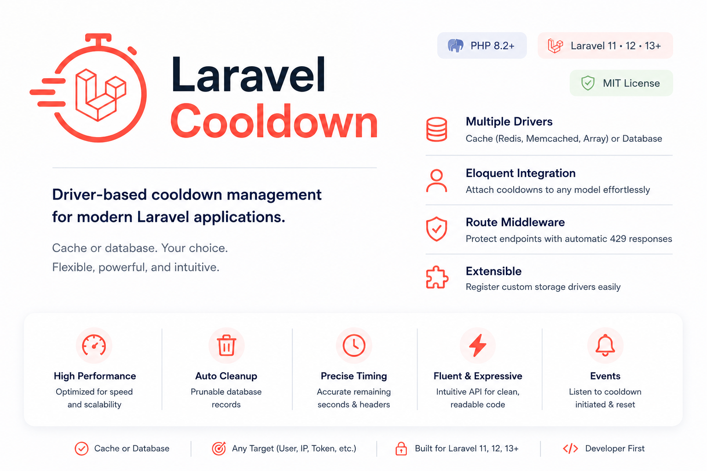

<p align="center">
    
</p>

# Laravel Cooldown

[](https://packagist.org/packages/zaber-dev/laravel-cooldown)
[](https://github.com/zaber-dev/laravel-cooldown/actions/workflows/run-tests.yml)
[](https://packagist.org/packages/zaber-dev/laravel-cooldown)
[](https://packagist.org/packages/zaber-dev/laravel-cooldown)
[](https://packagist.org/packages/zaber-dev/laravel-cooldown)

**Supports:** Laravel 11, 12 & 13+ • PHP 8.2+ • Redis • Memcached • Database

Laravel Cooldown is a driver-based cooldown management package for Laravel that helps you enforce time-based restrictions on actions, workflows, and endpoints.

Manage cooldowns using cache or database storage, attach them directly to Eloquent models, protect routes with middleware, and extend the package with custom storage drivers—all through a clean, expressive API.

> Unlike Laravel's built-in `RateLimiter`, Laravel Cooldown is designed for persistent, entity-scoped action cooldowns and workflow delays with interchangeable cache and database storage.

---


## Quick Example

```php
Cooldown::for('password_reset', $user)
    ->enforce()
    ->for(300);
```
---

## Documentation

- [Installation](#installation)
- [Configuration](#configuration)
- [Usage Guide](#usage-guide)
- [LEARN.md](LEARN.md)

---

## Features

- **Multiple Storage Drivers** (Cache & Database): Switch seamlessly between high-performance `cache` stores (Redis, Memcached, Array) and persistent `database` storage with automatic cleanup.
- **Expressive Fluent API**: Chain expressive calls like `Cooldown::for('send_email', $user)->using('database')->for(300)` or enforce limits with `enforce()`.
- **Native Eloquent Integration**: Attach the `HasCooldowns` trait to any model for scoped action tracking (`$user->cooldown('password_reset')->active()`).
- **Route & Endpoint Middleware**: Protect endpoints automatically using `cooldown:action_name,duration_in_seconds` with automatic HTTP `429` enforcement and `Retry-After` headers.
- **Immutable DTOs**: Work safely with strict `CooldownInfo` Data Transfer Objects returning precision durations (`remainingSeconds()`, `remainingForHumans()`).
- **Prunable Database Storage**: Built-in `Prunable` trait integration ensures expired database records never clutter your database.
- **Custom Driver Extensibility**: Register custom storage drivers on the fly with closure-based creators via `Cooldown::extend()`.

---
## Common Use Cases

Laravel Cooldown is ideal for:

- Password reset requests
- Email verification
- SMS / OTP sending
- AI prompt generation
- Report exports
- Payment retries
- Promotional rewards
- API actions
- Spam protection
- User workflows

---

## Why Laravel Cooldown?

While Laravel includes a built-in `RateLimiter` designed primarily for request throttling (e.g., "60 requests per minute"), **Laravel Cooldown** is engineered for temporal action constraints, workflow delays, and entity-scoped cooldowns across multiple storage backends.

| Feature | Laravel RateLimiter | Custom Cache Checks | Laravel Cooldown |
| :--- | :---: | :---: | :---: |
| **Fluent Builder API** (`Cooldown::for()->until()`) | ❌ | ❌ | ✅ **Expressive & Clean** |
| **First-Class Eloquent Integration** (`$user->cooldown()`) | ❌ | ❌ | ✅ **Native (`HasCooldowns`)** |
| **Driver-Based Architecture** (`cache` & `database`) | ❌ Cache Only | ❌ Manual | ✅ **Both Supported** |
| **Success-Only Middleware Triggering** | ❌ (Triggers on 4xx/5xx) | ❌ | ✅ **Only on 2xx / 3xx** |
| **Temporal / Time-Based Delays & Constraints** | ⚠️ Limited | ❌ Manual | ✅ **Subsecond Precision** |
| **Immutable DTOs (`CooldownInfo`)** | ❌ | ❌ | ✅ **Strict (`CarbonImmutable`)** |
| **Automatic Database Pruning** (`model:prune`) | N/A | ❌ Manual SQL | ✅ **Built-in (`Prunable`)** |
| **Polymorphic Target Scoping** (Models, Scalars, IPs) | ❌ Manual Keys | ❌ Manual Keys | ✅ **Automatic Key Mapping** |
| **Custom Driver Extensibility** (`Cooldown::extend()`) | ❌ | ❌ | ✅ **Closure / Container** |
| **Event Dispatching** (`CooldownInitiated` / `Reset`) | ❌ | ❌ | ✅ **Configurable Events** |

---

## Installation

Ready to get started? Install the package with Composer:

```bash
composer require zaber-dev/laravel-cooldown
```

Publish the configuration and database migrations:

```bash
php artisan vendor:publish --provider="ZaberDev\Cooldown\CooldownServiceProvider"
```

Run migrations if you intend to use the `database` driver:

```bash
php artisan migrate
```

---

## Configuration

The configuration file `config/cooldowns.php` allows you to define your default storage driver, driver parameters, and event dispatching behaviors:

```php
return [
    /*
    |--------------------------------------------------------------------------
    | Default Cooldown Driver
    |--------------------------------------------------------------------------
    |
    | Supported drivers: "cache", "database"
    |
    */
    'default' => env('COOLDOWN_DRIVER', 'cache'),

    'drivers' => [
        'cache' => [
            'driver' => 'cache',
            'store' => env('COOLDOWN_CACHE_STORE', null),
            'prefix' => 'cooldowns:',
        ],
        'database' => [
            'driver' => 'database',
            'table' => 'cooldowns',
        ],
    ],

    'events' => [
        'dispatch' => true,
    ],
];
```

---

## Usage Guide

### 1. The Fluent Cooldown API

The `Cooldown` facade provides an expressive builder interface for setting, checking, enforcing, and resetting cooldowns.

#### Setting a Cooldown
```php
use ZaberDev\Cooldown\Facades\Cooldown;

// Put a 5-minute cooldown on "export_reports" globally
Cooldown::for('export_reports')->for(300);

// Put a 1-hour cooldown on a specific user
Cooldown::for('send_sms', $user)->for(3600);

// Set expiration using Carbon / DateTimeInterface
Cooldown::for('daily_bonus', $user)->until(now()->endOfDay());
```

#### Checking Cooldown Status
```php
// Check if an action is currently active (on cooldown)
if (Cooldown::for('send_sms', $user)->active()) {
    $info = Cooldown::for('send_sms', $user)->info();
    
    echo "Please wait " . $info->remainingForHumans() . " before trying again.";
    echo "Seconds remaining: " . $info->remainingSeconds();
}

// Check if NOT on cooldown
if (Cooldown::for('send_sms', $user)->expired()) {
    // Proceed with action...
}
```

#### Enforcing Cooldowns (`enforce`)
If you want to automatically halt execution and throw an HTTP `429 Too Many Requests` exception when a cooldown is active, call `enforce()`:

```php
// Throws CooldownActiveException (HTTP 429) if active, automatically attaching 'Retry-After' header
Cooldown::for('login_attempt', $user)->enforce();
```

#### Resetting / Clearing Cooldowns
```php
// Immediately clear the cooldown for this action/target
Cooldown::for('send_sms', $user)->reset();
```

---

### 2. Eloquent Model Integration (`HasCooldowns`)

Add the `HasCooldowns` trait to any Eloquent model to scope cooldowns directly to that entity:

```php
namespace App\Models;

use Illuminate\Foundation\Auth\User as Authenticatable;
use ZaberDev\Cooldown\HasCooldowns;

class User extends Authenticatable
{
    use HasCooldowns;
}
```

You can now interact directly with your model instance:

```php
$user = User::find(1);

// Set a 2-minute cooldown on "update_profile" for this user
$user->cooldown('update_profile')->for(120);

// Check active status
if ($user->cooldown('update_profile')->active()) {
    return response()->json([
        'message' => 'Too many profile updates.'
    ], 429);
}

// Enforce limits and throw 429 exception if active
$user->cooldown('update_profile')->enforce();

// Reset the cooldown
$user->cooldown('update_profile')->reset();
```

#### Polymorphic Database Querying
When using the `database` driver, `HasCooldowns` also exposes a `cooldowns()` polymorphic relationship, allowing direct querying and bulk management:

```php
// Get all database cooldown records assigned to this user
$activeCooldowns = $user->cooldowns()->where('expires_at', '>', now())->get();

// Delete all cooldown records for this user
$user->cooldowns()->delete();
```

---

### 3. Route & Endpoint Middleware

Protect routes declaratively without writing boilerplate checks in your controllers using the `CheckCooldown` middleware:

```php
use Illuminate\Support\Facades\Route;

// Enforce a 60-second cooldown on form submissions per User / IP address
Route::post('/contact/submit', [ContactController::class, 'submit'])
    ->middleware('cooldown:contact_submit,60');

// Use a specific driver or dynamic action key
Route::post('/api/reports/generate', [ReportController::class, 'generate'])
    ->middleware('cooldown:report_gen,300,database');
```

**How the Middleware Works:**
1. Before executing the controller, the middleware checks `Cooldown::for('action', $request->user() ?? $request->ip())`.
2. If active, it throws `CooldownActiveException` with HTTP `429` and a valid `Retry-After` header.
3. If not active, the controller executes. If the response is successful (`2xx` or `3xx`), the cooldown is automatically initiated for the specified duration. If the controller fails (`4xx`/`5xx`), the cooldown is **not** applied so the user can correct their input and retry.

---

### 4. Working with Drivers (`using` & `driver`)

By default, the package uses the driver defined in `config/cooldowns.php`. You can switch drivers on the fly per request or action:

```php
// Store transient rate checks in fast cache/Redis
Cooldown::for('api_ping', $ip)->using('cache')->for(30);

// Store billing/audit cooldowns persistently in SQL database
Cooldown::for('billing_charge', $user)->using('database')->for(86400);

// Direct driver instance access
$cacheDriver = Cooldown::driver('cache');
$cacheDriver->put('custom_key', 180);
```

#### Registering Custom Drivers
You can extend the `CooldownManager` with your own storage drivers (e.g., DynamoDB, MongoDB) in your `AppServiceProvider`:

```php
use ZaberDev\Cooldown\Contracts\CooldownDriverContract;
use ZaberDev\Cooldown\Facades\Cooldown;

public function boot(): void
{
    Cooldown::extend('redis-cluster', function ($app) {
        return new MyRedisClusterCooldownDriver($app['redis']);
    });
}
```

---

### 5. Database Pruning (`Prunable`)

When using the `database` driver, expired records are automatically marked for pruning via Laravel's `Prunable` trait on the `ZaberDev\Cooldown\Models\Cooldown` model.

To clean up old records automatically, schedule Laravel's `model:prune` command in your `console.php` or `Kernel.php`:

```php
use Illuminate\Support\Facades\Schedule;
use ZaberDev\Cooldown\Models\Cooldown;

Schedule::command('model:prune', ['--model' => Cooldown::class])->daily();
```

---

### 6. Events

Whenever a cooldown is initiated or cleared, the package dispatches strongly typed events if enabled (`cooldowns.events.dispatch = true`):

- **`ZaberDev\Cooldown\Events\CooldownInitiated`**: Dispatched when `for()` or `until()` creates a cooldown (`$key`, `$expiresAt`, `$action`, `$target`).
- **`ZaberDev\Cooldown\Events\CooldownReset`**: Dispatched when `reset()` clears a cooldown (`$key`, `$action`, `$target`).

You can listen to these in your `EventServiceProvider` for logging, monitoring, or webhook triggers.

---

## Testing & Quality

Run the comprehensive PHPUnit test suite locally:

```bash
composer test
```

### Automated CI Matrix (`run-tests.yml`)
Every commit and pull request is automatically tested across multiple PHP and Laravel environments via GitHub Actions (`.github/workflows/run-tests.yml`):
- **PHP Versions**: `8.2`, `8.3`, `8.4`
- **Laravel Versions**: `11.*`, `12.*`, `13.*`
- **Stability**: `prefer-stable` & `prefer-lowest`

### Automated Packagist Synchronization (`update-packagist.yml`)
When publishing releases (`v*`) or pushing to `main`, our GitHub Action automatically hooks into Packagist (`https://packagist.org/packages/zaber-dev/laravel-cooldown`) to ensure immediate release synchronization.

---

## Contributing

Thank you for considering contributing! Please ensure any pull requests include thorough PHPUnit tests covering unit, feature, and driver integration scenarios.

---

## License

The MIT License (MIT). Please see [LICENSE.md](LICENSE.md) for more information.
